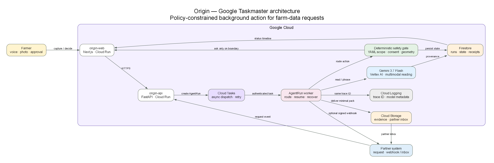

# Origin

**A farmer-controlled AI agent that turns messy field evidence into the smallest safe data share.**

Origin is built for the [All Things Agentic Hackathon](https://allthingsagentichackathon.devpost.com/) and is designed for the **Taskmaster** use case: it receives a partner request, finds or captures the required farm fact, checks the request against a farmer-defined permission boundary, and either delivers the exact approved fields or pauses for consent.

> Capture once. Share only on your terms. See every action.

## The problem

Farmers repeatedly enter the same spray, harvest, and compliance facts into different partner portals. The work is tedious, but blindly automating it would be unsafe: a new recipient, purpose, field, or expiry must return control to the farmer.

Origin makes this a bounded agent workflow instead of another form or chatbot:

1. Gemini reads a voice note, photo, or typed field record into a draft.
2. The farmer confirms the fact; deterministic rules compile only the requested fields.
3. Every partner request becomes a durable, traceable `AgentRun`.
4. A policy gate checks partner, purpose, exact field containment, and expiry.
5. The run either delivers through Cloud Storage/webhook or waits for a precise consent decision.
6. The farmer sees the run steps, model provenance, receipts, revoke notices, and deletion notices.

## Why it is agentic

Origin does more than generate text. It observes a request, plans the next safe action, invokes tools, persists state across an asynchronous run, recovers from retries, and acts in an external partner system. The authority boundary stays deterministic: **Gemini may read and explain, but it never decides whether data may be shared.**

| Agent capability | Origin implementation |
|---|---|
| Perception | Gemini on Vertex AI extracts a structured event from voice, image, or text |
| Durable execution | Cloud Tasks dispatches an `AgentRun`; Firestore stores status and steps |
| Tool use | Rule compiler, geometry check, consent engine, Cloud Storage delivery, signed webhook |
| Human checkpoint | A scoped consent card shows the exact field names and values |
| External action | A partner-specific JSON package is delivered once, idempotently |
| Observability | Shared trace ID, model provenance, run timeline, delivery and receipt records |

## Google Cloud architecture



| Component | Google technology | Responsibility |
|---|---|---|
| Agent framework | Google Gen AI SDK (`google-genai`) | Gemini tool-facing orchestration and structured generation |
| Foundation model | Gemini 3.7 Flash on Vertex AI | Multimodal extraction and concise explanations |
| Web and API | Cloud Run | Next.js farmer/partner experience and FastAPI control plane |
| Async runtime | Cloud Tasks | Retryable, authenticated `AgentRun` dispatch |
| Durable state | Firestore | Events, permissions, runs, traces, receipts, and delivery state |
| Evidence and delivery | Cloud Storage | Original evidence and recipient-specific JSON packages |
| Identity | Firebase ID tokens or demo principals | Farmer and partner tenancy |
| Operations | Cloud Logging | Correlated run and model-call metadata |

The same lifecycle runs inline with a local JSON store, so the complete demo remains usable without cloud credentials. See [architecture details](docs/architecture.md) and the [decision record](docs/decisions.md).

## Three-minute demo

1. On **Today**, Heartland Grain requests a seasonal spray statement.
2. On **Speak**, record or type the field operation. Gemini produces a draft with confidence and provenance; the farmer confirms it.
3. Origin compiles only the requested fields and shows their exact values on the consent card. Give permission and optionally allow identical future requests.
4. The Partner Desk receives the package and exposes its delivery destination and trace ID.
5. Save a second field operation while no request is open; Origin stores it and sends nothing. When the partner asks, Cloud Tasks runs the request and delivers only because it fits the standing permission exactly.
6. Change the purpose: the next run stops at `waiting_for_farmer`.
7. In **Who**, revoke access or erase Origin's copy. Origin records recipient notices without falsely claiming downloaded copies disappeared.

The narrated version is in [docs/demo-script.md](docs/demo-script.md).

## Safety invariants

- No model call decides access, performs the geometry check, or widens a field list.
- Standing permission requires an exact partner and purpose, a non-expired grant, and `requested_fields ⊆ allowed_fields`.
- Every model result is marked with provider, model, location, confidence, and fallback state.
- Task retries reuse request, consent, and delivery identifiers.
- Revocation disables Origin-issued access immediately; notices accurately describe limits on previously downloaded data.
- Yield and revenue are denied by the compiler even when a questionnaire asks for them.
- Vertex AI uses Application Default Credentials; no model API key is stored in the repository.

## Repository

```text
apps/web/                 Next.js farmer experience and Partner Desk
apps/api/origin/          FastAPI agent, consent, compiler, and cloud adapters
apps/api/rules/           Deterministic US and EU share rules
apps/api/tests/           Offline lifecycle and safety tests
deploy/                   Cloud Build and Google Cloud deployment files
docs/                     English architecture and submission material
opm/                      Detailed OPM engineering appendix
```

## Run locally

API (PowerShell):

```powershell
Set-Location apps\api
py -3 -m pip install -r requirements.txt
$env:PYTHONPATH = "."
py -3 -m uvicorn origin.main:app --reload --port 8000
```

Web:

```powershell
Set-Location apps\web
npm install
npm run dev
```

Open [http://localhost:3000](http://localhost:3000) for the farmer experience, [http://localhost:3000/desk](http://localhost:3000/desk) for the Partner Desk, and [http://127.0.0.1:8000/docs](http://127.0.0.1:8000/docs) for OpenAPI.

The local profile uses deterministic fallbacks and demo principals (`demo-farmer`, `demo-partner`). To use Vertex AI, authenticate with ADC and set `ORIGIN_GCP_PROJECT`; all options are documented in [apps/api/.env.example](apps/api/.env.example).

## Test

```powershell
Set-Location apps\api
$env:PYTHONPATH = "."
py -3 -m pytest tests -q

Set-Location ..\web
npx tsc --noEmit
npm run build
```

The offline suite covers the capture-to-delivery loop, AgentRun state transitions, task authentication, standing-permission containment, duplicate delivery protection, revoke/erase semantics, questionnaire sanitisation, tenancy, and Gemini fallback behavior.

## Deploy to Google Cloud

Prerequisites: an authenticated `gcloud` CLI with permission to create Cloud Run, Cloud Tasks, Firestore, Cloud Storage, Artifact Registry, IAM, and Cloud Build resources.

```powershell
.\deploy\deploy.ps1 -ProjectId "YOUR_PROJECT_ID"
```

The script enables required APIs, creates a least-purpose runtime service account, queue, bucket, and Firestore database, builds both services, deploys them to Cloud Run, and configures authenticated task dispatch. `.gcloudignore` files keep local data, notes, caches, and environment files out of build uploads. Review the [submission checklist](docs/submission.md) before recording the demo.

## Design choices

Origin deliberately uses the Google Gen AI SDK directly instead of LangGraph. This keeps the judged agent path visibly Google-native, reduces orchestration surface area, and lets Cloud Tasks plus `AgentRun` provide the durable state machine the product actually needs. The deterministic policy engine remains independently testable.

Apache-2.0 — see [LICENSE](LICENSE).
